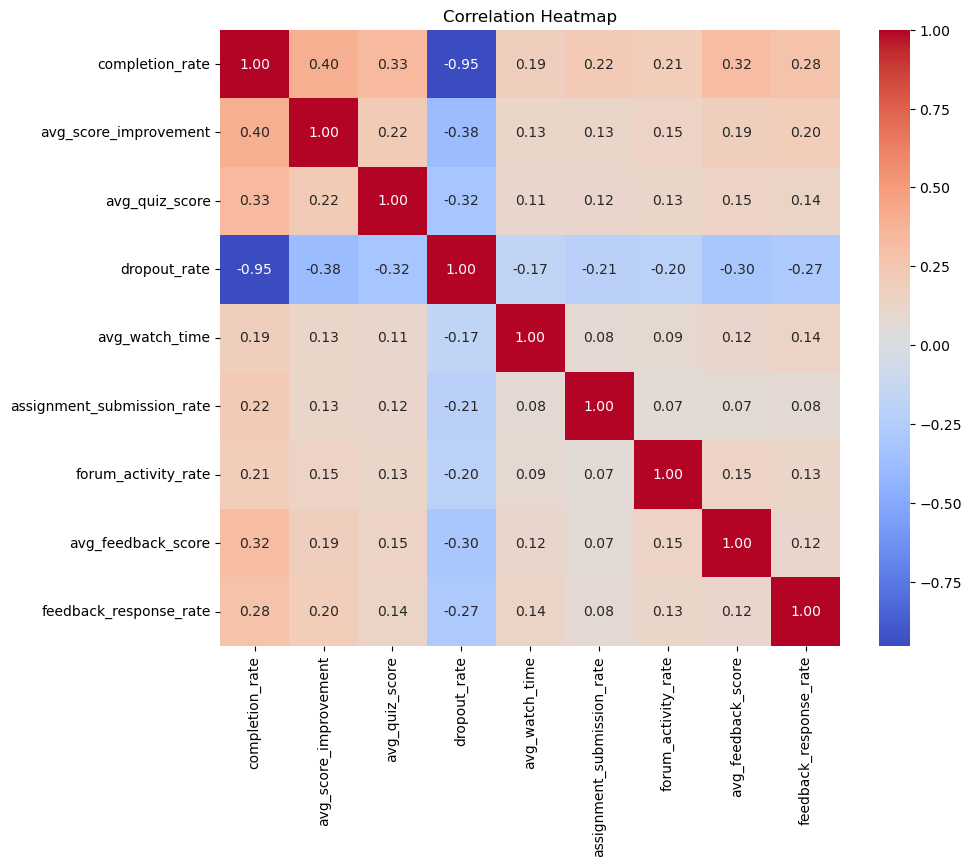
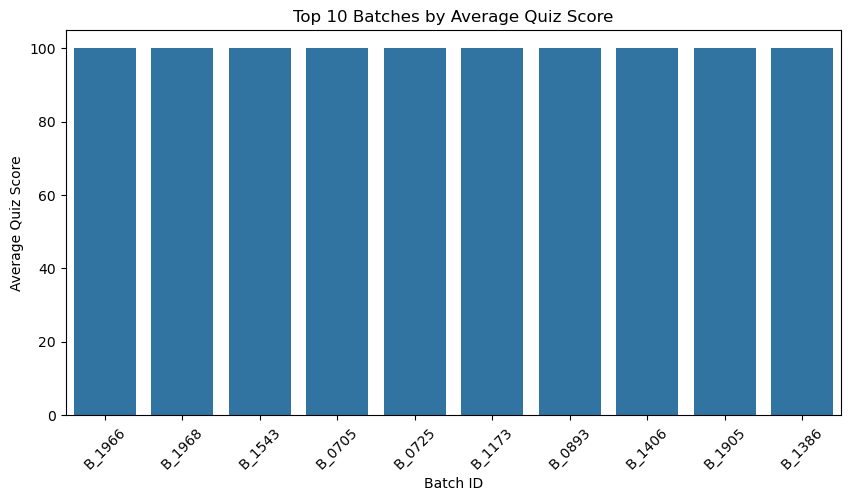
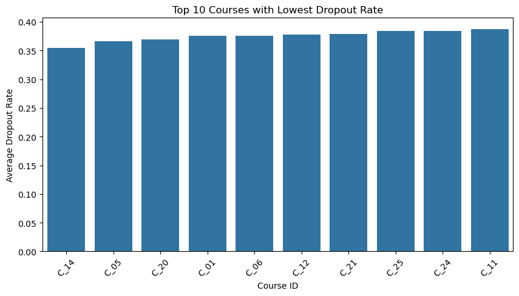

# 📊 Instructor Effectiveness Analysis

Analyzing student engagement and academic performance data to identify what drives instructor effectiveness — and where course completion is being lost.

[](https://www.python.org/)
[](https://pandas.pydata.org/)
[](https://numpy.org/)
[](https://matplotlib.org/)
[](https://seaborn.pydata.org/)
[](https://jupyter.org/)

---

## 📌 Business Problem

Educational platforms invest heavily in instructors, but without measurable performance data it's hard to know which instructors and courses are driving strong outcomes — and which are causing students to disengage or drop out.

This project analyzes **2,000 batch-level records** to answer:
- Which factors are most strongly linked to student dropout and low completion?
- Which instructors and courses are performing best, and why?
- What concrete actions can improve completion rate, engagement, and satisfaction?

## 🗂️ Dataset

2,000 rows covering `completion_rate`, `avg_quiz_score`, `dropout_rate`, `avg_watch_time`, `assignment_submission_rate`, `forum_activity_rate`, `avg_feedback_score`, and `feedback_response_rate` across instructors, courses, and batches.

## 🔍 Approach

1. **Data Cleaning** — checked for missing values, duplicates, invalid ranges, and outliers (boxplots).
2. **Exploratory Data Analysis** — distributions, correlation analysis, and relationship scatterplots between engagement metrics and performance.
3. **Group-wise Comparison** — ranked instructors, courses, and batches on completion, quiz scores, and feedback.
4. **Insight & Recommendation Generation** — translated statistical patterns into actionable steps.

## 📈 Key Findings

| Metric | Insight |
|---|---|
| Completion vs. Dropout | Strong negative correlation (**-0.95**) — improving completion sharply cuts dropout |
| Completion vs. Quiz Score | Students who complete courses score meaningfully higher |
| Feedback vs. Completion | Instructors with higher completion rates get better feedback scores |
| Watch Time vs. Quiz Score | Only weakly correlated — more watch time ≠ better learning |
| Assignment Submission | Positively linked to completion — engagement matters more than content volume |

**Correlation Heatmap**



**Top 10 Batches by Average Quiz Score**



**Courses with the Lowest Dropout Rates**



## ✅ Recommendations

1. Encourage instructors to adopt the teaching strategies used by top performers.
2. Monitor courses with high dropout and investigate root causes of disengagement.
3. Increase assignment participation through reminders and structured deadlines.
4. Promote forum participation to strengthen collaborative learning.
5. Track instructor performance regularly using completion rate, feedback score, and quiz performance as core KPIs.

## 🛠️ Tech Stack

Python · Pandas · NumPy · Matplotlib · Seaborn · Jupyter Notebook

## 🚀 Future Scope

- Predictive ML model for instructor effectiveness
- Interactive dashboard (Tableau / Power BI)
- Multi-semester trend analysis
- Automated instructor performance reports

## 📁 Project Structure

```
instructor-effectiveness-analysis/
├── data/
│   └── instructor_effectiveness_dataset_2000_rows.xlsx
├── images/
│   └── (charts used in this README)
├── Instructor_Effectiveness_Analysis.ipynb
├── requirements.txt
├── LICENSE
└── README.md
```

## ▶️ How to Run

```bash
git clone https://github.com/<your-username>/instructor-effectiveness-analysis.git
cd instructor-effectiveness-analysis
pip install -r requirements.txt
jupyter notebook Instructor_Effectiveness_Analysis.ipynb
```

## 👤 Author

**Subhash Uniyal**
Aspiring Data Analyst / Data Scientist
[GitHub](https://github.com/suniyal416-byte) · [LinkedIn](https://linkedin.com/in/suniyal416-byte)

---

*If you found this useful, consider ⭐ starring the repo!*
